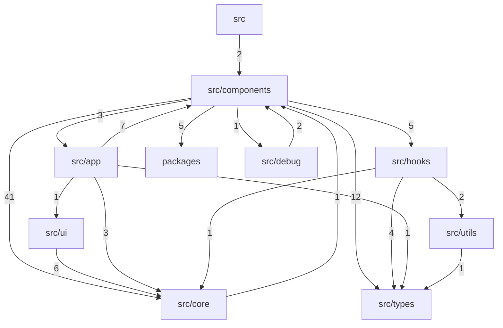

# Dependency Graph

> Auto-generated by `ArchitectureAssetsSync.hook.ts`. Last refreshed: 2026-06-28T23:31:27.199Z
> Scanned 117 source files. Edges aggregate to top-level directories (or `src/<name>`).

## Module graph

## Edge counts

| From | To | Imports |
|---|---|---|
| `src/components` | `src/core` | 41 |
| `src/components` | `src/types` | 12 |
| `src/app` | `src/components` | 7 |
| `src/ui` | `src/core` | 6 |
| `src/components` | `src/hooks` | 5 |
| `src/components` | `packages` | 5 |
| `src/hooks` | `src/types` | 4 |
| `src/app` | `src/core` | 3 |
| `src/components` | `src/app` | 3 |
| `src/debug` | `src/components` | 2 |
| `src/hooks` | `src/utils` | 2 |
| `src` | `src/components` | 2 |
| `src/app` | `src/ui` | 1 |
| `src/app` | `src/types` | 1 |
| `src/components` | `src/debug` | 1 |
| `src/core` | `src/components` | 1 |
| `src/hooks` | `src/core` | 1 |
| `src/utils` | `src/types` | 1 |